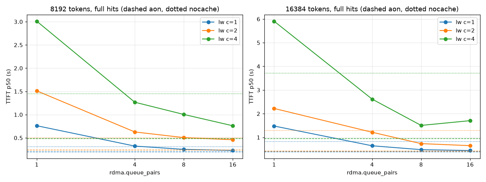

# Perf rerun with the kv-sink sink-path fixes

2026-10-05, new MI300X droplet, kv-sink server `9c16972132` (placement pool, several RC
queue pairs per region), client `5a24afdbb6` (`as_sink_config.queue_pairs`), LMCache
`prototype-stage-1b` `81288120` (`rdma.queue_pairs`). Llama-3.1-8B, TP=1, Soft-RoCE `rxe0`,
device namespace on the scratch disk. Baseline: the committed `functional/perf/` (old
droplet, server `046e8558d1`, client `523d51eaa6`, one QP). Versions and run definitions:
[VERSIONS.md](VERSIONS.md); box and harness changes: [CHANGES.md](CHANGES.md).

**Verdict.** The sink-path fixes work: the layer-by-layer (lw) fetch is about 5x faster
(1.05 → 5.3 GiB/s at 16 queue pairs), lw now beats recompute (nocache) at every full-hit
point, and the 5 s-wait engine stop moved from c=8 to c=32. lw still does not beat
all-or-nothing (aon) over TCP on full hits: aon is 1.1x faster at c=1 and 2.4x at c=16,
because LMCache still runs one vLLM worker's retrieves one at a time (D-27).

## Answers

1. **Did lw over Soft-RoCE move off ~1.05 GiB/s? Yes.** Per-layer timeline, 8k c=1
   (32 MiB layers, median spacing; `timeline_table.md`, `E_timeline_qp<n>` on the box):

   | `queue_pairs` | Layer spacing | lw fetch | Raw `ib_write_bw` (this box) | lw / raw |
   |---|---|---|---|---|
   | old run (1 QP, old server) | 28.6 ms | 1.09 GiB/s | 2.16 GiB/s (old box) | 50% |
   | 1 | 22.5 ms | 1.37 GiB/s | 2.30 GiB/s | 60% |
   | 4 | 8.7 ms | about 3.5 GiB/s | 5.43 GiB/s | 64% |
   | 8 | 6.3 ms | about 4.7 GiB/s | 8.75 GiB/s | 54% |
   | 16 | 5.6 ms | about 5.3 GiB/s | not measured | - |

   Layer 0 now lands after 10-16 ms at 8-16 QPs (26-40 ms at 1 QP). asd's busiest thread
   ran at 35-40% of a core and was rarely in disk wait (`D`); the old run was often in `D`
   behind QD1 reads.

2. **Does lw at `queue_pairs=8` beat aon's ~6.1 GiB/s over TCP? No.** 8 QPs give about
   4.7 GiB/s and 16 about 5.3 GiB/s. In TTFT, lw at 16 QPs is 0.232 s against aon's
   0.205 s at 8k c=1, and 0.437 s against 0.388 s at 16k.

3. **Does lw beat aon or nocache anywhere?**
   - Full hits: lw beats nocache at every valid point, 1.1-2.6x (8k c=1 0.232 vs 0.312 s;
     16k c=16 6.32 vs 16.72 s). It never beats aon: aon/lw TTFT is 1.13x at c=1 and 2.4x at
     c=16 for both lengths.
   - Partial hits (E4, 8k new tokens, c = 1 and 4): lw beats aon at 3 of 4 points (2k + 8k
     c=1 0.621 vs 0.698 s, c=4 1.937 vs 2.285 s; 8k + 8k c=1 1.006 vs 1.193 s). nocache is
     still fastest at 3 of 4 (0.445, 1.546, 0.819 s); lw beats nocache only at 8k + 8k c=4
     (3.135 vs 3.726 s; aon 2.872 s).
4. **Did the D-27 engine stops change? Yes, they moved, but D-27 itself is unchanged.**
   With the default 5 s wait, vLLM's engine now stops only at c=32 (8k and 16k;
   `LayerProgressRetrieveGenerationTimeoutError`, "retrieve generation 30 (shared memory
   shows 27)"). The old run stopped at 8k c=8 and 16k c=8, 16, 32. Retrieves are still
   serialized: lw TTFT doubles with c (8k: 0.23, 0.45, 0.90, 1.72, 3.37 s at c=1..16). With
   the 600 s wait, c=32 is 6.54 s at 8k (old 30.8 s) and 12.63 s at 16k (old 63.3 s).
5. **Device vs memory namespace (8k c=1, `memns/`).**

   | | Memory namespace | Device namespace |
   |---|---|---|
   | aon TTFT p50 | 0.126 s | 0.205 s |
   | lw 1 QP: TTFT p50 / fetch | 0.726 s / 1.44 GiB/s | 0.761 s / 1.37 GiB/s |
   | lw 8 QPs: TTFT p50 / fetch | 0.248 s / about 5.0 GiB/s | 0.252 s / about 4.7 GiB/s |
   | asd disk reads per E3 session | 0 | 4.1 GiB |

   The old box's memory namespace reached only 1.3 GiB/s against the 2.16 GiB/s one-QP
   ceiling. Here memory reaches 1.44 of 2.30 GiB/s (63%). The disk accounts for only about
   5% of lw's time now. The box has one NUMA node (`host_topology.txt`, kernel
   `6.8.0-138-generic`), and asd's busiest thread peaked at 30% of a core (mean 6%), so
   neither NUMA nor server CPU is the limit. The remaining gap is per layer in the sink
   path (22 ms per 32 MiB layer against 13.6 ms at the raw one-QP rate). We did not
   isolate it further; that needs server-side timestamps per placement.

## Full-hit sweeps (`queue_pairs` 16), TTFT p50 in seconds

`lw` is the default 5 s layerwise wait; `lw600` is the 600 s wait. "stop" means the engine
stopped (INVALID). Full tables with totals: `summary_tables.md`; every point: `results.csv`.

| 8k, c | 1 | 2 | 4 | 8 | 16 | 32 |
|---|---|---|---|---|---|---|
| nocache | 0.312 | 0.497 | 1.445 | 2.754 | 6.030 | 13.403 |
| aon | 0.205 | 0.263 | 0.496 | 0.854 | 1.427 | 2.643 |
| lw | 0.232 | 0.454 | 0.895 | 1.720 | 3.370 | stop |
| lw600 | 0.227 | 0.449 | 0.869 | 1.717 | 3.346 | 6.538 |
| old lw (1 QP) | 1.022 | 2.021 | 4.057 | stop | not run | not run |

| 16k, c | 1 | 2 | 4 | 8 | 16 | 32 |
|---|---|---|---|---|---|---|
| nocache | 0.821 | 1.285 | 3.715 | 7.434 | 16.716 | 37.935 |
| aon | 0.388 | 0.481 | 0.903 | 1.562 | 2.630 | 4.991 |
| lw | 0.437 | 0.825 | 1.616 | 3.197 | 6.324 | stop |
| lw600 | 0.433 | 0.651 | 1.639 | 3.568 | 6.421 | 12.628 |
| old lw (1 QP) | 1.992 | 3.922 | 7.798 | stop | stop | stop |

Queue-pair scan (8k and 16k, c = 1, 2, 4, QPs 1 / 4 / 8 / 16): `qpscan_summary_tables.md`,
`charts/qp_scan.png`. 16 QPs was best at every point except 16k c=4 (8 QPs 1.506 s, 16 QPs
1.707 s). lw at 1 QP on the new server is about 25% faster than the old lw (8k c=1 0.761 vs
1.022 s): that part is the placement pool.

## Controls and checks

- **Box check.** `ib_write_bw` on `rxe0`: 2.30 / 5.43 / 8.75 GiB/s at 1 / 4 / 8 QPs (old
  box 2.16 / 5.4 / 8.6). nocache p50 at c=1: 0.312 s at 8k and 0.821 s at 16k (old 0.323 and
  0.801). nocache at c = 2-4 is within 7% of the old box; at c = 8-32 it is 6-13% slower
  (the newer vLLM/ROCm image). Every comparison above is against this box's own nocache and
  aon.
- **aon control (TCP).** Within 9% of the old run at c <= 8 (8k c=1 0.205 vs 0.215 s, 16k
  c=1 0.388 vs 0.391 s), and 9-12% faster at c=16 (8k 1.427 vs 1.621 s, 16k 2.630 vs
  2.892 s) and at 16k c=32 (4.991 vs 5.532 s); 8k c=32 is equal (2.643 vs 2.644 s).
  **Not explained.** The vLLM/ROCm stack differs and the old server was not rerun (by
  request), so the server and the stack cannot be separated here.
- **E2 tcp-lw** (layerwise over TCP, nothing deferred): 8k c=1 0.207 s against aon 0.198 s
  (`exp_table.md`). The layerwise machinery still costs nothing measurable.
- **Correctness gate**, new server and client, at `queue_pairs` 1 and 8 (`gate/` on the
  box): the RDMA logic suites (80 tests, `make logic-test`) pass. The pipelined RDMA
  integration test lands every stored byte and falls back on a missing record (3 passed,
  2 skipped by their own conditions, as on the VM). `kvlayers --qps`: 10,240 rows OK, 0
  unexpected, 2 / 16 RC QPs live on `rxe0` (both sides of each pair). `perf.sh smoke` is
  valid. kv-sink logs: no late writes, region errors or drops; the only warnings are
  Aerospike's OS best-practice checks.
- **Validity.** 81 full-hit points (12 nocache, 66 cached, 3 memory namespace) and the
  E-experiment points; 2 INVALID (lw c=32 at 8k and 16k, the engine stops). 354 lw
  retrieves were `pipelined` and 1 `failed` (in the 8k c=32 stop). Every
  store check matched 65 records per chunk at about 50% of the data file, with no
  stop-writes, write errors or `DEVICE_OVERLOAD`.
- **D-28** (released memoryview after an engine stop): 7 errors after the 8k stop, 0 after
  the 16k stop.

## Not run

- **Long prompts (32k-128k, step 7).** The plan ran them only if lw beat aon at 16k c=1
  after the sweeps; it did not (0.437 vs 0.388 s).
- The old server and client (by request). Hardware RDMA (none on this droplet).

## Caveats

- Soft-RoCE is software RDMA on one host: queue pairs scale it because each QP is
  processed separately in the kernel. Hardware RoCE/EFA numbers will differ.
- The E3 rates come from a box-only print patch in `pump.py`, reverted after each run
  (CHANGES.md); the TTFTs in the tables come from sessions without it.
- The hourly Slack reports quoted the session logs' approximate p50 (`ttft_p50~`). This
  file and `results.csv` use NumPy's interpolated p50 over each point's requests, as
  `functional/perf/` does. The two differ at small `n`, for example nocache 8k c=2:
  0.497 s against the approximate 0.674 s.
